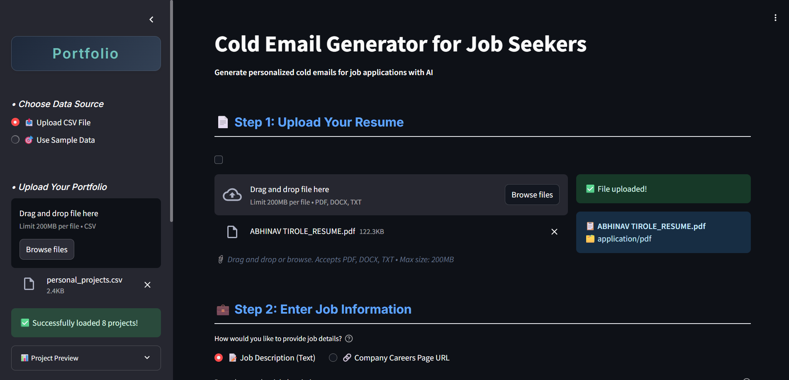
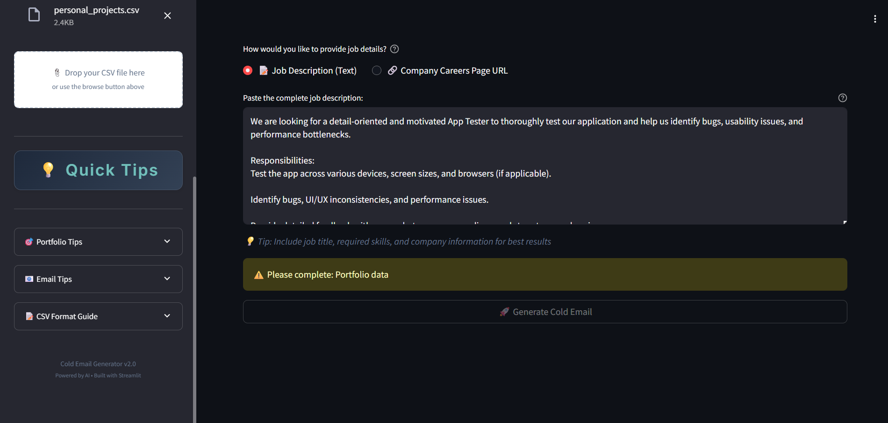
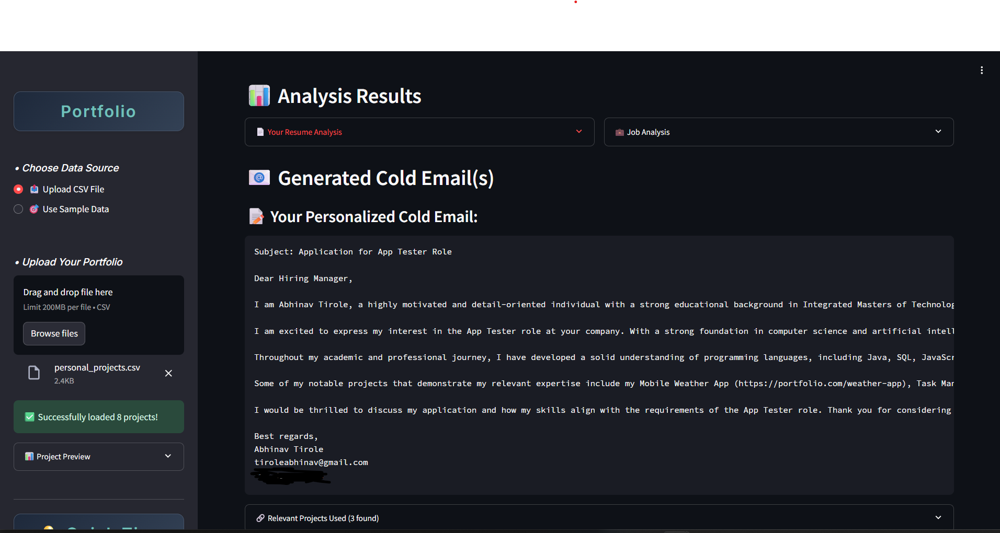

# 🚀 ColdConnect.Ai -- Cold Email Generator for Job-Seeking Candidates

A smart, AI-powered web app that helps job seekers generate **personalized cold emails** to companies by analyzing their resume, past projects, and the job description.
## Preview 



## 🔧 Features

1. **Upload Project Portfolio**

   * Upload `Excel` or `.csv` files containing:

     * `Project_Name`: Name of your project
     * `Description`: Brief project summary
     * `Tech_Stack`: Technologies used
     * `Links`: Live demo (optional)
     * `GitHub`: Repository URL (optional)

2. **Upload Resume**

   * Upload your resume in `.pdf` or `.doc` format.

3. **Paste Job Description or URL**

   * Either paste the **job description** directly or provide a **job posting URL**.

4. **Personalized Email Generation**

   * The app will:

     * Extract relevant job keywords and skills
     * Analyze your resume for matching experience and projects
     * Retrieve contextually relevant projects from your portfolio using a vector database
     * Generate a **cold email draft** tailored to the role and your profile

## 🧠 Tech Stack

| Tech          | Purpose                                 |
| ------------- | --------------------------------------- |
| **GroqCloud** | LLM backend for fast, smart generation  |
| **LangChain** | Logic chaining and orchestration        |
| **ChromaDB**  | Vector DB for semantic project matching |
| **Streamlit** | Lightweight web UI for interaction      |

## ✅ How It Works

1. Upload your resume and project details.
2. Paste the job description or job post URL.
3. Let the AI analyze your background and the job role.
4. Get a **ready-to-send cold email** for outreach!

## 📦 Installation & Usage

```bash
git clone https://github.com/ABHINAV2087/ColdConnectai_Cold-Email.git
cd ColdConnectai_Cold-Email
pip install -r requirements.txt
streamlit run app.py
```

> Make sure to set up your API keys for GroqCloud if required.


## 🤝 Contributing

Pull requests are welcome. For major changes

